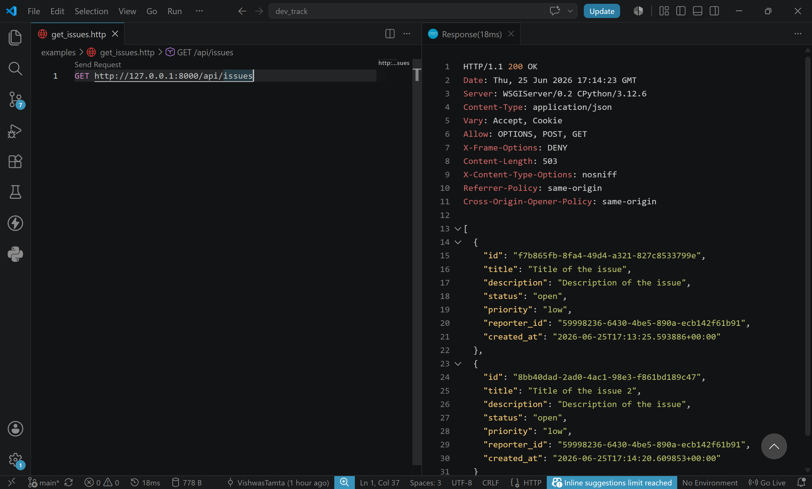
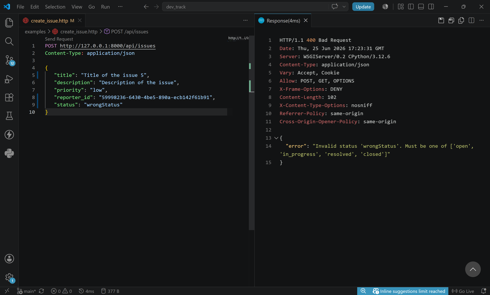

# DevTrack API

A lightweight Django-based issue tracking API that stores data in JSON files and exposes reporter and issue endpoints.

## 📌 Project Overview

This project provides a simple REST-style API for:
- Managing issue reports
- Managing reporters

It uses the following structure:
- `issues/api/issues.py` — issue-related request handling
- `issues/api/reporters.py` — reporter-related request handling
- `utils/json_utils.py` — JSON file read/write utilities
- `issues/views.py` — view wrappers for API functions
- `issues/urls.py` — application route definitions

## 🚀 How to Run

1. Open a terminal in the project root: `c:\air_tribe\dev_track`
2. Install dependencies:
   ```bash
   pip install -r requirements.txt
   ```
3. Start the Django development server:
   ```bash
   python manage.py runserver
   ```
4. Access the API at:
   - `http://127.0.0.1:8000/api/issues`
   - `http://127.0.0.1:8000/api/reporters`

> Note: This project reads and writes data in the root-level JSON files `issues.json` and `reporters.json`.

## 🧪 Endpoints

### `GET /api/issues`
Returns all saved issues.

Query params:
- `id` — return a specific issue by its ID
- `status` — return all issues with a given status

Example responses:
- `GET /api/issues` — all issues
- `GET /api/issues?id=<issue-id>` — issue by ID
- `GET /api/issues?status=open` — filtered by status

### `POST /api/issues`
Creates a new issue and stores it in `issues.json`.

Required body fields:
- `title`
- `description`
- `priority` (`low`, `medium`, `high`, `critical`)
- `status` (`open`, `in_progress`, `resolved`, `closed`)
- `reporter_id`

Validation is performed before saving. Invalid input returns a 400 response.

### `GET /api/reporters`
Returns all reporters.

Query params:
- `id` — return a specific reporter by ID

Example responses:
- `GET /api/reporters` — all reporters
- `GET /api/reporters?id=<reporter-id>` — reporter by ID

### `POST /api/reporters`
Creates a new reporter and stores it in `reporters.json`.

Required body fields:
- `name`
- `email`
- `team` (`backend`, `frontend`, `devops`)

Validation is performed for required fields and valid team values.

## 🔧 Design Decisions

This project was refactored to improve separation of concerns and make the API easier to maintain:

- Moved request-specific logic into `issues/api/issues.py` and `issues/api/reporters.py`.
- Added `utils/json_utils.py` to centralize JSON file reading and writing.
- Kept lightweight view wrappers in `issues/views.py`, so API logic is reusable and easy to test.
- Defined endpoint routing cleanly in `issues/urls.py` and included it in `devtrack/urls.py`.

These changes make the project easier to extend and keep business logic separate from Django view plumbing.

## 🖼️ Screenshots

### Success cases

- `screenshots/success/create_issue.png`
- `screenshots/success/get_issues.png`
- `screenshots/success/get_reporter_by_id.png`

### Failed cases

- `screenshots/failed/create_issue_required_status.png`
- `screenshots/failed/create_issue_wrong_status.png`

### Preview





## 📁 Notes

- The API uses file-based storage rather than a database for issue and reporter persistence.
- The Django admin is available at `/admin/` if the built-in admin app is configured.
- The current `Issue` and `Reporter` classes include validation logic in `issues/models.py`.

Enjoy exploring the DevTrack API!